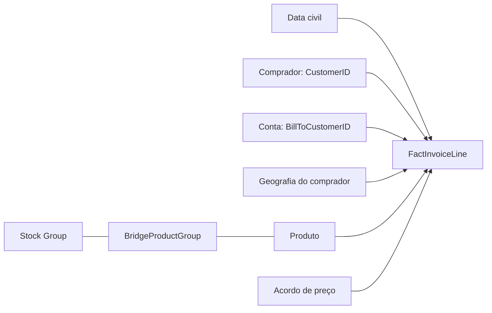

# Performance Comercial e Rentabilidade

Análise de faturamento, margem e concentração de carteira com **SQL Server e modelagem dimensional**.

Este projeto prepara uma base verificável para investigar vendas, rentabilidade registrada e concentração de clientes. A fonte é a **Wide World Importers OLTP**, da Microsoft: uma empresa fictícia com dados sintéticos. Os resultados não representam uma empresa real nem resultados profissionais do autor.

Esta primeira versão entrega a fundação analítica: aquisição e auditoria da fonte, contrato de métricas, modelo dimensional, SQL e validação. As análises comerciais Q01–Q07 e a camada Power BI serão adicionadas posteriormente.

## O que está implementado

- SQL Server Express LocalDB 2025: modelo no esquema `analytics`, preservando a origem OLTP.
- Python, com biblioteca padrão, para aquisição, hashes e conferência de evidências.
- PowerShell/.NET SqlClient para executar SQL em série e registrar resultados.
- **21 medidas K01–K21**, com contexto de filtros, períodos e denominadores explícitos.
- **19 contratos C01–C19**: 607 verificações aprovadas, zero falhas; 565 são asserts SQL. As demais conferem evidências, precisão, módulos e execução.

Não há dependências Python externas, serviços cloud ou ferramentas de integração.

## Modelo e decisões

O grão da `FactInvoiceLine` é **um registro por InvoiceLineID original**, com 228.265 linhas e 70.510 faturas.



- **Comprador × cobrança:** 663 compradores e 263 contas são perspectivas separadas da mesma população. Não são somados como clientes diferentes.
- **Stock Groups:** 227 produtos e 442 associações. Selecionar grupos representa a união de produtos, sem duplicação ou rateio. Subtotais sobrepostos não são aditivos. Os 45 pares possíveis foram testados, sem divergências.
- **Rentabilidade:** margem = soma de `LineProfit` / soma das vendas sem impostos. `LineProfit` é lucro comercial registrado, não lucro líquido, EBITDA ou margem de contribuição.
- **Sinais e preços:** as 4.626 linhas negativas e 512 condições especiais permanecem nos totais, com preço e lucro originais. As especiais são identificadas por elegibilidade histórica, não pelo sinal.
- **Tempo:** calendário civil completo entre 01/01/2013 e 31/05/2016. Comparações usam períodos equivalentes; junho–dezembro/2016 são indisponíveis.

[Modelo, grãos e relacionamentos](reports/modelo_etapa4.md) · [Contrato analítico](reports/contrato_analitico_etapa3.md)

## Controles de validação

Os números abaixo são controles técnicos do snapshot, não conclusões comerciais. Valores em **UM — unidades monetárias da base**.

| Controle | Valor |
| --- | ---: |
| Vendas sem impostos | 172.261.341,20 |
| Impostos | 25.782.098,25 |
| Faturamento com impostos | 198.043.439,45 |
| Lucro comercial registrado | 85.729.180,90 |
| Margem comercial registrada | 49,7669% |
| Resultado das linhas negativas | −320.493,55 |

As somas reconciliam em centavos. Testes cobrem chaves, integridade, conjuntos de IDs, filtros, relações muitos-para-muitos, calendário, comparadores e precisão.

[Resultados individuais dos testes](reports/validacao_etapa4.md) · [Evidência SQL](data/metadata/stage4-20260930-120408.json) · [Fechamento da Etapa 4](data/metadata/stage4-closeout.json)

## Fonte e reprodução

Fonte exclusiva: [release oficial Microsoft WWI v1.0](https://github.com/microsoft/sql-server-samples/releases/tag/wide-world-importers-v1.0), arquivo `WideWorldImporters-Standard.bak`, 126.951.424 bytes; asset publicado em outubro/2022.

SHA-256:

```text
066279a8cd28c8d85cbd8215ea71a5d672b420cfbc19756b635c27bd8027dada
```

[Manifesto da fonte](data/metadata/source_manifest.json) · [Avisos e atribuição](NOTICE.md)

Pré-requisitos para executar SQL: Windows, SQL Server Express LocalDB 2025, Windows PowerShell 5.1 e Python 3.14 (versão usada). Os scripts não instalam programas. O backup e os bancos não são versionados.

Para verificar a evidência publicada, sem iniciar LocalDB:

```powershell
python scripts/verify_stage4.py
```

Para preparar uma fonte nova, criar a camada uma única vez e executar as métricas, siga o [guia de reprodução](reports/reproducao.md). Para revalidar um banco já preparado:

```powershell
powershell.exe -NoProfile -ExecutionPolicy Bypass -File scripts/run_stage4.ps1 -Mode Validate
python scripts/verify_stage4.py
```

## Estrutura

| Caminho | Conteúdo |
| --- | --- |
| `sql/` | Criação do modelo, métricas e validação |
| `scripts/` | Aquisição, restauração, runners e verificadores |
| `reports/` | Diagnóstico, contrato, modelo, testes e reprodução |
| `data/metadata/` | Proveniência, evidências e código oficial de referência |
| `data/raw/`, `data/sqlserver/` | Artefatos locais, ignorados pelo Git |

## Limites e próximos passos

Os dados são sintéticos e refletem regras de um gerador. Não há créditos observados nem despesas suficientes para inferir lucro líquido. Os preços especiais reproduzem a fórmula da amostra; não foram “corrigidos” nem usados para estimar receita perdida. Atributos cadastrais são tratados conforme as limitações do [diagnóstico](reports/diagnostico_etapa2.md).

As [sete perguntas analíticas](reports/contrato_analitico_etapa3.md#9-sete-perguntas-oficiais-de-negócio) são trabalho futuro. Depois virão Power BI, screenshots e validação SQL × Power BI, em `feature/power-bi`, com Pull Request para `main`. Essa branch e o dashboard ainda não foram criados.
