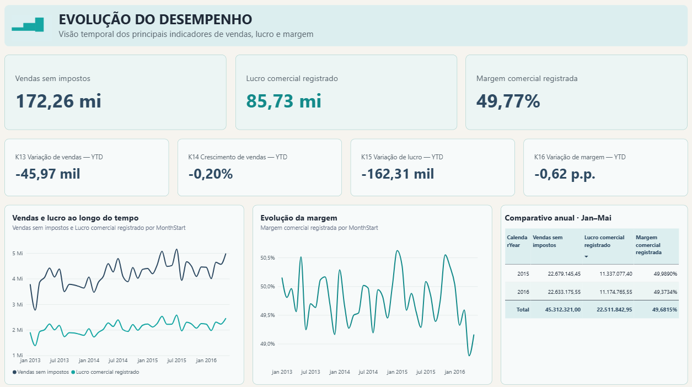
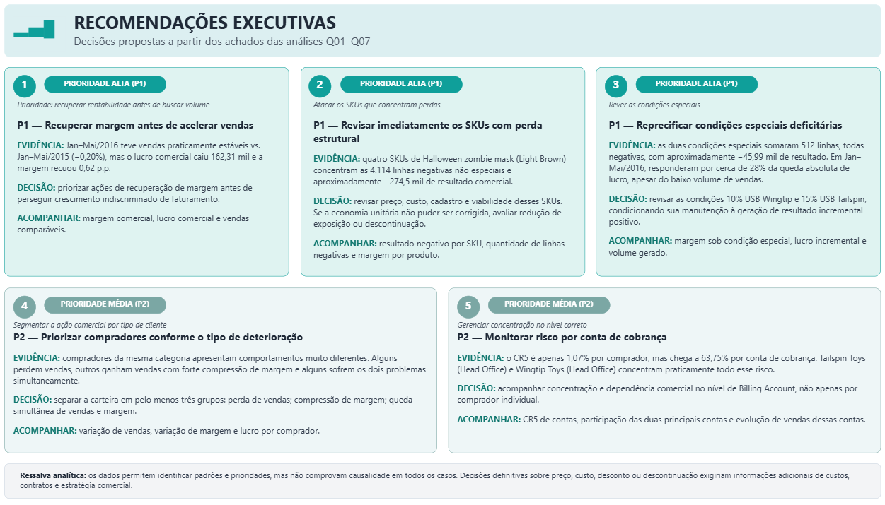

# Análise Comercial WWI — SQL, Modelagem Dimensional e Power BI

Case end-to-end de Business Intelligence com o dataset **sintético Microsoft Wide World Importers**: validação de dados, modelagem dimensional, métricas de negócio, análise comercial e recomendações executivas.

O projeto está finalizado como case de portfólio. Demonstra metodologia analítica e capacidade de transformar dados em decisões; não representa resultados de uma empresa real nem resultados da experiência profissional do autor.



*Dashboard executivo — evolução de vendas, lucro comercial registrado e margem. O relatório usa mi/mil, sem sufixo monetário nos valores.*

## Visão geral e problema de negócio

Uma gestão comercial precisa distinguir crescimento de vendas, rentabilidade e concentração de carteira. O case investiga onde o lucro se deteriora, como as perdas se distribuem e quais decisões mereceriam investigação adicional. As recomendações são propostas; não há impacto financeiro realizado ou recuperação estimada.

O trabalho combina raciocínio comercial com SQL, Python, modelagem dimensional, DAX, Power BI em modo Import e comunicação executiva. A experiência do autor em gestão de varejo orienta as perguntas, sem uso de dados confidenciais.

## Perguntas analíticas

| Pergunta | Foco |
| --- | --- |
| Q01 | Como vendas, lucro comercial registrado e margem evoluem em períodos comparáveis? |
| Q02 | Quais produtos explicam a variação absoluta do lucro? |
| Q03 | Como vendas e margem se comportam por comprador e categoria de cliente? |
| Q04 | Qual é o nível de concentração comercial por comprador, conta de cobrança e produto? |
| Q05 | Como se compõem as linhas com resultado negativo e qual é o papel das condições especiais? |
| Q06 | Como vendas e margem variam geograficamente quando controlamos produto e segmento? |
| Q07 | Qual é a relação entre mix de produtos, condições especiais e margem agregada? |

## Arquitetura da solução


Python, com biblioteca padrão, apoia aquisição, hashes e conferência de evidências; PowerShell/.NET SqlClient executa SQL em série. A preparação técnica, o modelo analítico, a camada semântica, a visualização e a interpretação de negócio têm responsabilidades separadas. Não há cloud, Docker ou ferramentas de integração adicionais.

## Modelo analítico

Grão da fato: **um registro por `InvoiceLineID` original**. A data oficial é `InvoiceDate`.

| Tabela | Registros |
| --- | ---: |
| FactInvoiceLine | 228.265 |
| DimDate | 1.247 |
| DimBuyer | 663 |
| DimBillingAccount | 263 |
| DimProduct | 227 |
| DimGeography | 655 |
| DimStockGroup | 10 |
| BridgeProductGroup | 442 |
| DimSpecialDeal | 2 |

São nove tabelas analíticas, além de `_Medidas` no Power BI. **Buyer e Billing Account são conceitos distintos:** 663 compradores não equivalem a 263 contas de cobrança. A ponte seleciona a união de produtos, preservando o grão da fato.

[Modelo e relacionamentos](reports/modelo_etapa4.md) · [Contrato K01–K21 e C01–C19](reports/contrato_analitico_etapa3.md)

## Principais métricas

Controles do histórico completo disponível, de janeiro/2013 a maio/2016. Valores financeiros em unidade monetária neutra, sem atribuição de moeda real. A notação UM nos comentários analíticos é documental; o dashboard não exibe esse sufixo.

| Métrica | Valor |
| --- | ---: |
| Vendas sem impostos | 172.261.341,20 |
| Impostos | 25.782.098,25 |
| Faturamento com impostos | 198.043.439,45 |
| Lucro comercial registrado | 85.729.180,90 |
| Margem comercial registrada | 49,7669% |
| Faturas | 70.510 |
| Compradores | 663 |
| Contas de cobrança | 263 |
| Produtos faturados | 227 |

`LineProfit` é **lucro comercial registrado**, não lucro líquido, EBITDA ou margem de contribuição. Margem é a razão agregada entre soma do lucro e soma das vendas sem impostos, nunca a média das margens das linhas.

## Principais insights

**Rentabilidade deteriorou mais que vendas.** Em Jan–Mai/2016 versus Jan–Mai/2015, vendas variaram −45.969,90 UM (−0,2027%), lucro comercial registrado −162.311,85 UM e margem −0,6156 p.p. O principal desafio observado é rentabilidade, com vendas praticamente estáveis. Junho–dezembro/2016 são **indisponíveis**, não zeros.

**Perdas concentradas em poucos SKUs.** No histórico, 4.626 linhas negativas somam −320.493,55 UM. Quatro SKUs `Halloween zombie mask (Light Brown)` concentram as 4.114 ocorrências negativas não especiais e −274.500,00 UM. Isso descreve concentração, sem provar causa operacional ou ganho recuperável.

**Condições especiais negativas, mas insuficientes para explicar toda a queda.** As duas condições abrangem 512 linhas e −45.993,55 UM. No comparável, a variação desse resultado corresponde aritmeticamente a cerca de 28% da queda absoluta do lucro. Não é uma estimativa causal. Sua participação histórica nas vendas é 0,0127%, não participação nas linhas negativas.

**Concentração depende do nível de análise.** CR5: compradores **1,0739%**, contas de cobrança **63,7540%**, produtos **21,0290%**. Olhar apenas compradores ocultaria concentração relevante em Billing Account; não foi definido limiar de “risco crítico”.

**Mix compatível com pressão sobre a margem.** No comparável, Novelty Items ganhou 739.290,65 UM em vendas, com margem aproximada de 36,02%; Packaging Materials perdeu 679.761,55 UM, com margem de 51,47%. O padrão é compatível com composição desfavorável, sem atribuição causal em pontos percentuais.

[Análise executiva detalhada Q01–Q07](reports/analise_executiva_powerbi.md)

## O que eu faria como gestor

| Prioridade e proposta | Evidência e decisão a investigar |
| --- | --- |
| P1 — Recuperar margem antes de acelerar vendas | Vendas −0,20%, lucro −162,31 mil UM e margem −0,62 p.p.; priorizar rentabilidade antes de crescimento indiscriminado. |
| P1 — Revisar SKUs com perda estrutural | Quatro SKUs de Halloween concentram as perdas não especiais; revisar preço, custo, cadastro e viabilidade, considerando menor exposição/descontinuação se a economia unitária não puder ser corrigida. |
| P1 — Reprecificar condições especiais deficitárias | 512 linhas e −45,99 mil UM; revisar os acordos USB Wingtip 10% e USB Tailspin 15%, condicionando manutenção a resultado incremental positivo demonstrável. |
| P2 — Priorizar compradores conforme a deterioração | Distinguir perda de vendas, compressão de margem e queda simultânea para orientar a investigação comercial. |
| P2 — Monitorar concentração por conta de cobrança | Acompanhar CR5 e dependência comercial no nível Billing Account, além do comprador individual. |

Os dados identificam padrões e prioridades, mas não comprovam causalidade operacional em todos os casos. Decisões definitivas sobre preço, custo, desconto ou descontinuação exigiriam custos detalhados, contratos e estratégia comercial. Resultado incremental é um critério futuro de decisão, não uma métrica causal já estimada.



## Dashboard Power BI

O relatório oferece oito páginas visíveis e uma página técnica preservada, oculta no modo de leitura. A Q01 é a página inicial. As capturas abaixo são cópias dos arquivos finais fornecidos pelo autor, sem edição de pixels.

### Galeria completa

<details>
<summary>Abrir as oito páginas</summary>

1. [Evolução](docs/images/powerbi/01_evolucao.png)
2. [Produtos](docs/images/powerbi/02_produtos.png)
3. [Clientes](docs/images/powerbi/03_clientes.png)
4. [Concentração](docs/images/powerbi/04_concentracao.png)
5. [Resultados negativos](docs/images/powerbi/05_resultados_negativos.png)
6. [Geografia](docs/images/powerbi/06_geografia.png)
7. [Mix e condições especiais](docs/images/powerbi/07_mix_condicoes_especiais.png)
8. [Recomendações executivas](docs/images/powerbi/08_recomendacoes_executivas.png)

</details>

## Validação e qualidade

- **SQL/modelo: 607 PASS / 0 FAIL**, incluindo 565 asserts SQL persistidos e 42 verificações complementares; não são 607 + 565 testes.
- **Power BI Desktop: 85 PASS / 0 FAIL**, execução manual do DAX Query View confirmada pelo autor. Não foi reexecutada nesta etapa documental.
- Auditoria final: nove páginas, oito visíveis, 71 visuais e 37 consultas analíticas preservadas; nenhum visual fora do canvas. SemanticModel logicamente preservado; somente format strings monetárias foram ajustadas para apresentação. A ordenação descendente da tabela Q02 foi aprovada manualmente.
- O schema visual original `2.13.0` retornou 404; validação auxiliar com schema publicado `2.7.0`, sem conversão. O verificador Python conserva a ocorrência conhecida `KeyError: 'isActive'`; não se alterou o modelo para contorná-la.

[Validação final e hashes](reports/validacao_powerbi_final.md) · [Evidência SQL](data/metadata/stage4-20260930-120408.json)

## Limitações e cuidados analíticos

- **Stock Groups se sobrepõem:** 227 produtos e 442 associações. Participações não são aditivas; somar grupos duplica observações. O join ingênuo produz 450.703 linhas e 275.964.455,10 UM de vendas, contra os corretos 228.265 registros e 172.261.341,20 UM. Esses números inflados são sentinelas de erro, não resultados comerciais.
- Dados sintéticos; sem comprovação de causalidade, metas, custos operacionais completos ou resultados de intervenções.
- Zero notas de crédito observadas: não permite analisar política de devoluções. Lucro negativo não é crédito.
- A implementação Microsoft calcula o preço percentual especial como preço-base × percentual / 100, e não como desconto convencional de 10%/15%. Os registros originais foram preservados. Não se atribui esse mecanismo a uma empresa real.
- Geografia é a localidade de entrega do comprador; controles por segmento/produto não isolam todos os fatores comerciais.

[Diagnóstico e semântica da fonte](reports/diagnostico_etapa2.md)

## Estrutura do repositório

```text
.
├── powerbi/
│   ├── analise_comercial_wwi.pbix
│   ├── analise_comercial_wwi.pbip
│   ├── WWI.Report/
│   └── WWI.SemanticModel/
├── docs/images/powerbi/
├── reports/
├── sql/
├── scripts/
├── data/metadata/
└── README.md
```

## Como reproduzir

Para visualizar o resultado salvo, abra o [PBIX final](powerbi/analise_comercial_wwi.pbix) no Power BI Desktop. Para editar a estrutura versionável, abra o [PBIP](powerbi/analise_comercial_wwi.pbip). Um refresh exige reproduzir SQL Server LocalDB e o esquema `analytics`; abrir o resultado importado não exige restaurar o banco.

O [guia de reprodução](reports/reproducao.md) documenta aquisição, restauração, construção e validação. Ambiente usado: Windows, LocalDB 2025, PowerShell/.NET SqlClient e Python 3.14. Não execute novamente Build sobre uma camada existente.

Fonte exclusiva: [release oficial Microsoft WWI v1.0](https://github.com/microsoft/sql-server-samples/releases/tag/wide-world-importers-v1.0), `WideWorldImporters-Standard.bak`. [Manifesto](data/metadata/source_manifest.json) e [NOTICE](NOTICE.md) preservam rastreabilidade e licença Microsoft; nenhuma licença nova foi atribuída ao código autoral. Backup e bancos locais não são versionados.

## Artefatos finais

- [PBIX final](powerbi/analise_comercial_wwi.pbix)
- [PBIP versionável](powerbi/analise_comercial_wwi.pbip)
- [Contrato analítico](reports/contrato_analitico_etapa3.md)
- [Modelo dimensional](reports/modelo_etapa4.md)
- [Validação da Etapa 4](reports/validacao_etapa4.md)
- [Análise executiva](reports/analise_executiva_powerbi.md)
- [Validação final Power BI](reports/validacao_powerbi_final.md)
- [Reprodução](reports/reproducao.md)

PBIX: 5.881.598 bytes (5,609129 MiB). SHA-256:

```text
59790e542a37df2b3288a09e9beb97e555b2ed2e0f97145e42fd5204b727bee7
```

Os documentos das etapas anteriores registram o estado à época, inclusive entregas então planejadas. A documentação final acima registra sua conclusão posterior, sem reescrever evidências históricas.
