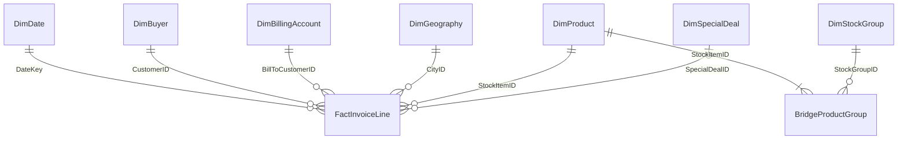

# Etapa 4 — modelo e camada SQL

Referência normativa: [contrato v1.0](contrato_analitico_etapa3.md). Esta implementação não redefine a população, os KPIs ou as perguntas. Resultados de execução estão em [validação](validacao_etapa4.md); este documento descreve as decisões técnicas.

## Arquitetura e grãos

SQL Server Express LocalDB 2025, instância `WWI_Portfolio`, banco existente `WWI_Portfolio_Diagnostic`, novo esquema `analytics`. As tabelas `Sales`, `Warehouse` e `Application` permanecem como origem, sem UPDATE, DELETE ou alterações de estrutura. Não há outro banco, exportação integral, pacote adicional ou serviço.

As tabelas analíticas são materializadas uma vez. As chaves naturais inteiras do snapshot são suficientes: não há necessidade de inventar chaves substitutas nem SCD2 para atributos cuja equivalência histórica é testada. Índices de PK, índice por data da fato e índice inverso da ponte sustentam integridade e filtros. Categoria e grupo comprador ficam desnormalizados no comprador; flags ficam na fato.



| Tabela | Grão / PK | Conteúdo e origem |
| --- | --- | --- |
| `FactInvoiceLine` | Uma linha por `InvoiceLineID` original | `InvoiceID`, `OrderID`, `OrderDate`, DateKey, CustomerID, BillToCustomerID, StockItemID, CityID; Quantity, PackageTypeID, UnitPrice, TaxRate, TaxAmount, ExtendedPrice e LineProfit originais; SalesExTax decimal(18,2); IsNegative, IsSpecial, SpecialDealID opcional |
| `DimDate` | Um dia civil / DateKey AAAAMMDD | CalendarDate, CalendarYear, MonthNumber, YearMonth numérico ordenável, MonthStart, MonthEnd, DayOfMonth, IsoDayOfWeek (segunda=1), IsCompleteYear |
| `DimBuyer` | Um comprador / CustomerID | Nome, CustomerCategoryID/Name, BuyingGroupID/Name, DeliveryCityID; NULL em grupo comprador preservado |
| `DimBillingAccount` | Uma conta observada nas faturas / BillToCustomerID | Nome do cadastro da conta; sem transplantar sua categoria/geografia para o comprador |
| `DimGeography` | Uma cidade de entrega dos compradores / CityID | Cidade, ID/código/nome do estado, ID/nome do país |
| `DimProduct` | Um produto / StockItemID | Nome, Brand, Size, ColorID/Name, UnitPackageID/Name do cadastro do snapshot; atributos opcionais continuam NULL |
| `DimStockGroup` | Um grupo cadastrado / StockGroupID | Nome, incluindo grupos sem produtos |
| `BridgeProductGroup` | Um par produto–grupo / PK composta | StockItemID e StockGroupID; sem peso de rateio ou grupo principal |
| `DimSpecialDeal` | Um acordo / SpecialDealID | Descrição, grupo comprador, Stock Group, vigência e percentual registrado; percentual não é interpretado como desconto convencional |

FKs físicas validadas ligam a fato às seis dimensões diretas e a ponte a produto/grupo. A associação a acordo é 0..1 por linha; demais referências diretas são obrigatórias. A FK adicional `DimBuyer.DeliveryCityID → DimGeography.CityID` verifica o atributo de linhagem. **Ela não define um segundo caminho de propagação de filtros:** conceitualmente, geografia filtra a fato diretamente, e comprador filtra a fato por CustomerID. Relações de interface Power BI ainda não foram implementadas.

`InvoiceID` e `OrderID` são identificadores de contexto na fato, não dimensões sem atributos úteis. `OrderDate` serve para elegibilidade de preços, não substitui InvoiceDate. Quantity permanece rastreável com PackageTypeID; não foi promovida a KPI entre embalagens diferentes. Tipos dos campos copiados por SELECT INTO conservam os tipos SQL da origem documentados no dicionário da Etapa 2.

## Regras implementadas

**Comprador e cobrança.** As duas chaves vêm da fatura. Filtros simultâneos intersectam linhas. Categoria, grupo comprador e geografia continuam do comprador em qualquer eixo. O cadastro atual fornece os atributos aceitos somente após equivalência com as versões históricas nas datas de faturamento. Os nomes e atributos descritivos de produto são rótulos do snapshot, sem pretensão de historização completa.

**Grupos sobrepostos.** Seleção de grupos usa `EXISTS` sobre a ponte: união de produtos e uma ocorrência de cada linha. Combina-se por interseção com outros filtros. Nenhum grupo selecionado equivale a nenhum filtro; grupo vazio gera zero somas e contagens dentro da cobertura. Linhas visuais de grupos não são somáveis. K11 em eixo grupo traz aviso de sobreposição; K12 retorna N/A nesse eixo. A ponte não é juntada diretamente à fato para somar dinheiro.

**Preços e sinais.** A carga consulta a versão histórica do produto em OrderDate, vigência inclusiva do acordo e elegibilidade por BuyingGroup/StockGroup. Rejeita múltiplas associações e divergência entre preço realizado e base histórica × percentual / 100. Não corrige preços nem lucros. IsNegative e IsSpecial são independentes; a associação a acordo fica registrada. Testes confrontam o conjunto de IDs e acordos com uma extração independente da elegibilidade auditada.

**Calendário.** Intervalo fixo de 01/01/2013 a 31/05/2016, com todos os dias. Anos completos: 2013–2015. Meses completos podem usar YoY ou MoM; janeiro até um mês completo do mesmo ano pode usar YTD. AUTO escolhe YoY para um mês, YTD para acumulado desde janeiro e nenhuma comparação nos demais recortes. Comparações de seleções parciais/descontínuas e sem cobertura anterior retornam N/A. Fev/2016 compara com fev/2015 completo. Não existe dependência de TODAY/data do computador.

## Interface dos KPIs

`analytics.Kpis` retorna 21 linhas (MetricID K01–K21), valores decimal(38,10) e contexto: período, comparador, filtros JSON, datas selecionadas, eixo/membro, unidades, papel do cliente, rótulo de ticket, aviso de grupos, natureza sintética e linhagem do contrato/backup. NULL representa N/A. Percentuais já estão em escala 0–100; K16 está em pontos percentuais. Não multiplicar novamente por 100 numa futura interface.

Parâmetros:

| Parâmetro | Regra |
| --- | --- |
| `@Start`, `@End` | Limites inclusivos; padrão é toda P0; fora da cobertura todos os KPIs ficam N/A |
| `@Filters` | Objeto JSON; arrays `buyers`, `bills`, `products`, `cities`, `categories`, `buyingGroups`, `stockGroups`; flags numéricas `negative`/`special` 0 ou 1. Arrays vazios não filtram; `buyingGroups:[null]` seleciona sem grupo. Chaves desconhecidas e formatos inválidos são rejeitados |
| `@Axis` | buyer (padrão), bill, product, group, city, category ou buyingGroup |
| `@MemberID` | Membro da linha visual; NULL é total da seleção. Restringe numeradores/recorte, mas não S em K11/K12 |
| `@Comparison` | AUTO, YOY, MOM, YTD ou NONE; regras de elegibilidade permanecem obrigatórias |
| `@Dates` | Lista JSON opcional de datas ISO dentro dos limites. Dias distintos delimitam o recorte; lacunas desabilitam a comparação automática |

Uma seleção externa de compradores/produtos permanece em S antes da linha visual e do Top 5. CR5 usa receita decrescente e ID crescente; só comprador, conta e produto são eixos válidos para K12. No eixo não exclusivo, o retorno de K12 é NULL. Para consultar “Sem grupo comprador”, utilizar o filtro explícito `buyingGroups:[null]` (não um ID artificial).

```sql
EXEC analytics.Kpis @Start='20160101', @End='20160531';
EXEC analytics.Kpis @Start='20160501', @End='20160531', @Comparison='MOM';
EXEC analytics.Kpis @Filters=N'{"products":[1,2,3,4,5,6]}', @Axis='product', @MemberID=1;
EXEC analytics.Kpis @Filters=N'{"stockGroups":[7,8]}', @Axis='group', @MemberID=7;
EXEC analytics.Kpis @Filters=N'{"buyingGroups":[null],"negative":1}';
```

K01–K04 são somas; K05 razão entre somas; K06–K09 contagens distintas; K10 razão por fatura; K11 usa S; K12 faz ranking em S; K13–K16 comparam períodos elegíveis com os mesmos filtros não temporais; K17–K21 descrevem conjuntos negativos/especiais preservando filtros explícitos. Fórmulas e interpretações continuam exclusivamente no contrato. `SafeRatio` centraliza denominadores não positivos. Valores monetários reconciliam exatamente em centavos; razões têm precisão decimal finita, documentada e verificada antes da exibição.

`SelectedLines` é função tabular interna para filtros sem período. `MonthlyControl` é uma view interna, sem filtros, com 41 meses densos e LAG de 1/12 meses para validação temporal. Não substituir KPIs filtrados por esta view. Suas colunas não são uma saída executiva; toda entrega de indicadores passa pelo contexto de `Kpis`.

## Execução conservadora e reprodução

Usar o backup/banco já restaurados e a instância da conta proprietária. Executar a partir da raiz, em PowerShell normal dessa conta; no Codex, registro e named pipes requerem sair da sandbox. Não é necessário instalar SSMS, driver Python ou pacote adicional.

```powershell
# Primeira criação: recusa sobrescrever esquema analytics existente.
powershell.exe -NoProfile -ExecutionPolicy Bypass -File scripts\run_stage4.ps1 -Mode Build
# Repetir somente as validações, preservando dados materializados.
powershell.exe -NoProfile -ExecutionPolicy Bypass -File scripts\run_stage4.ps1 -Mode Validate
python scripts\verify_stage4.py
```

O runner verifica o hash do backup e preservação de arquivos anteriores, inicia a instância exclusiva, executa lotes serialmente, salva evidências por tentativa e encerra normalmente o LocalDB em `finally`, inclusive se ocorrer erro. Verifica espaço antes/depois dos lotes; abaixo de 2 GiB interrompe, sem limpeza automática. Durante um lote, o monitor externo da execução também confere disco. Mantém MAXDOP 1 e teto de memória já configurados; consultas volumosas usam grants limitados. #temps de filtros e testes são transitórias e desaparecem com a conexão. Não há cópia permanente adicional da origem.

`01_model.sql` é uma criação transacional única. `02_metrics.sql` define módulos da camada. `03_validation.sql` compara origem e modelo, executa cenários reais da API e fixtures claramente rotuladas. Falhas deixam evidência e impedem declarar a etapa aprovada. Novos snapshots ou reconstrução são trabalho separado: não existe DROP automático nem alteração silenciosa do contrato.

O modo `Inspect` do runner permite conferir somente catálogo, FKs e módulos, sem executar cargas/testes. O runner rejeita resultados FAIL e ausência de asserts nos modos Build/Validate. O verificador aceita também um caminho relativo explícito para a evidência.

## Limites desta entrega

Esta camada não é prova de suporte/desempenho no Power BI. Q06 terá de mostrar suporte de produtos/segmentos comuns e cobertura excluída em cada comparação concreta. Q07 ainda não ganhou decomposição causal ou contrafactual; as medidas dão suporte descritivo, sem definir resultados comerciais. Nomes de categorias, visualização, DAX, `.pbix`, publicação e licença própria do código permanecem futuros. Dados sintéticos, créditos ausentes, condições especiais peculiares e ausência de despesas operacionais mantêm todos os limites da Etapa 3.


## Fechamento consolidado — 01/10/2026

**IMPLEMENTADO:** nove tabelas analíticas, quatro módulos SQL (SelectedLines, SafeRatio, Kpis, MonthlyControl), chaves/índices, calendário e flags. **TESTADO:** 607 verificações PASS, zero FAIL, zero contratos PENDENTE ou N/A. **DOCUMENTADO:** grãos, filtros, contratos, limitações, execução e evidências. **PLANEJADO:** análises Q01–Q07, Power BI, DAX, interface e publicação; nenhum deles foi iniciado nesta retomada.

### Retomada e cadeia de evidências

- [E0 — primeira tentativa](../data/metadata/stage4-20260930-115845.json): modelo/módulos criados; lote de validação expirou em 180 segundos. Resultado incompleto, não contado como PASS. LocalDB encerrado normalmente.
- [E1 — execução SQL completa](../data/metadata/stage4-20260930-120408.json): 565 asserts PASS, zero FAIL; 567 observações de indicadores = 27 cenários × 21 medidas. Terminou antes da retomada, após a última mensagem visível do chat. Não foi repetida.
- [E2 — inspeção de retomada](../data/metadata/stage4-inspect-20261001-122009.json): nove tabelas, contagens de catálogo, nove FKs habilitadas/confiáveis, quatro módulos e parada normal. Nenhuma recarga ou restauração.
- [E3 — guardas do runner](../data/metadata/stage4-runner-tests.json): três fixtures executam a função real que aceita PASS e rejeita FAIL/ausência de asserts. Sem inserção no banco.
- [E4 — módulos](../data/metadata/stage4-module-checks.json): corpos SQL iguais aos arquivos após normalizar somente CREATE/CREATE OR ALTER e finais de linha. SQL Server persistiu CREATE no catálogo; não havia divergência de lógica.
- [Validação consolidada](validacao_etapa4.md): 565 asserts SQL + 42 checagens independentes/de retomada = **607 PASS**. Observações de KPIs e execuções repetidas do verificador não aumentam essa contagem.

Os seis arquivos existentes da implementação foram lidos e preservados: os três SQL, run_stage4.ps1, verify_stage4.py e este documento. Não se confirmou a estimativa de “+639 linhas” como diff Git: a pasta não contém `.git`. `git status`, `git diff --stat` e `git diff` retornaram “not a git repository”. Não foi criado repositório, commit ou publicação.

### Tabelas confirmadas

| Tabela | Linhas | Grão |
| --- | ---: | --- |
| FactInvoiceLine | 228.265 | InvoiceLineID original |
| DimDate | 1.247 | Dia civil |
| DimBuyer | 663 | CustomerID |
| DimBillingAccount | 263 | BillToCustomerID |
| DimProduct | 227 | StockItemID |
| DimGeography | 655 | CityID de entrega do comprador |
| DimStockGroup | 10 | StockGroupID |
| BridgeProductGroup | 442 | Par StockItemID, StockGroupID |
| DimSpecialDeal | 2 | SpecialDealID |

São 70.510 faturas distintas na fato. Compradores e contas não são somados entre si. Ponte: 94 produtos em um grupo, 51 em dois e 82 em três. Condições especiais: 301 acordo 1 + 211 acordo 2 = 512; todas pertencem às 4.626 negativas; sobram 4.114 negativas não especiais. K19 = −320.493,55 UM. Créditos observados = zero.

### Reconciliação financeira

| Controle | Observado e referência | Resultado |
| --- | ---: | --- |
| K01 Vendas sem impostos | 172.261.341,20 UM | PASS, centavos exatos |
| K02 Impostos | 25.782.098,25 UM | PASS, centavos exatos |
| K03 Faturamento com impostos | 198.043.439,45 UM | PASS, K01 + K02 |
| K04 Lucro comercial registrado | 85.729.180,90 UM | PASS, sinal original |
| K05 Margem comercial registrada | 49,7669% na exibição | PASS, razão entre somas |

### Situação das 21 medidas

Todas estão **IMPLEMENTADAS, TESTADAS e DOCUMENTADAS**; nenhuma é apenas planejada. A implementação é `sql/02_metrics.sql`; E1 contém execução e comparação com resultados esperados, e o contrato permanece o dicionário normativo. N/A em períodos não comparáveis é resultado correto da medida, não ausência de teste.

| Medida | Nome | Evidência principal |
| --- | --- | --- |
| K01 | Vendas faturadas sem impostos | E1, C04 |
| K02 | Impostos faturados | E1, C04 |
| K03 | Faturamento com impostos | E1, C04 |
| K04 | Lucro comercial registrado | E1, C04 |
| K05 | Margem comercial registrada | E1, C06 + Decimal independente |
| K06 | Faturas de venda | E1, C14 |
| K07 | Clientes compradores com faturamento | E1, C10 |
| K08 | Contas de cobrança com faturamento | E1, C10 |
| K09 | Produtos faturados | E1, C14 |
| K10 | Ticket médio por fatura | E1, C14 + Decimal independente |
| K11 | Participação nas vendas selecionadas | E1, C13, seleção externa/membro visual |
| K12 | Concentração Top 5 — CR5 | E1, C13, três eixos e fixture de empate |
| K13 | Variação absoluta de vendas | E1, C16, cinco cenários comparáveis |
| K14 | Crescimento das vendas | E1, C16, incluindo base zero |
| K15 | Variação absoluta do lucro registrado | E1, C16 |
| K16 | Variação da margem registrada | E1, C16, pontos percentuais |
| K17 | Linhas de lucro negativo | E1, C07 |
| K18 | Percentual de linhas de lucro negativo | E1, C07 + Decimal independente |
| K19 | Resultado registrado nas linhas negativas | E1, C07 |
| K20 | Linhas em condições especiais de preço | E1, C08 |
| K21 | Participação das condições especiais nas vendas | E1, C08 |

### Contratos C01–C19

Cada ID abaixo corresponde ao campo `ContractID` em E1 e à seção individual da validação consolidada, com nome do teste, observado, esperado e PASS/FAIL. Consultas executadas: `sql/03_validation.sql`; verificações de arquivo/precisão/retomada: `scripts/verify_stage4.py`. A tabela apresenta o resultado observado e o vínculo à evidência, sem converter existência de código em aprovação.

| Contrato | Status | Consulta/verificação e resultado observado | Evidência |
| --- | --- | --- | --- |
| C01 Fonte e população | PASS | SHA-256 fixo; EXCEPT em ambos os sentidos: zero IDs perdidos/adicionais; hashes antigos preservados | E1 + verificador + E2 |
| C02 Grão e chaves | PASS | 228.265 IDs únicos; 70.510 faturas; zero PK nula e inconsistências de cabeçalho | E1; catálogo E2 |
| C03 Integridade referencial | PASS | Joins conservam 228.265 linhas; cobertura temporal sem faltas/multiplicação; nove FKs confiáveis | E1 + E2 |
| C04 Totais financeiros | PASS | Quatro totais exatos; identidades por fatura, mês e produto; cenários da API versus origem | E1 + Decimal |
| C05 Semântica financeira | PASS | Zero divergências nos campos originais e fórmulas; custo atual usado só como referência | E1 |
| C06 Margem e precisão | PASS | Razão entre somas; 49,7669%; denominadores zero/negativo N/A; média simples difere | E1 + Decimal |
| C07 Sinais e negativos | PASS | 4.626; −320.493,55; flags equivalentes ao sinal; K18=100% em negativas | E1 |
| C08 Condições especiais | PASS | 512 = 301 + 211; elegibilidade histórica reconciliada; 4.114 negativas não especiais | E1 |
| C09 Créditos | PASS | Zero créditos reais; guarda de carga rejeita snapshot com crédito | E1; não foram inseridos créditos fictícios |
| C10 Identidade de cliente | PASS | 663 compradores e 263 contas; IDs originais; filtro simultâneo por interseção | E1 |
| C11 Ponte de grupos | PASS | 227 produtos, 442 pares, distribuição 94/51/82; todos os grupos recompõem P0 | E1 |
| C12 União dos grupos | PASS | 45 pares executados; zero divergências de união/inclusão-exclusão para contagem e quatro somas | E1, duas asserções consolidadas dos pares |
| C13 Filtros e denominadores | PASS | S preserva seleção externa; CR5 exclusivo, até cinco IDs; fixture testa desempate; filtros inválidos rejeitados | E1 |
| C14 Não aditividade | PASS | Distintos recalculados; ticket parcial usa apenas linhas selecionadas, sem recuperar cesta | E1 + Decimal |
| C15 Tempo | PASS | 1.247 dias/41 meses; anos completos e 2016 parcial; domingo zero, fora da cobertura N/A | E1 |
| C16 Bordas temporais | PASS | Jan/2013 MoM e 2013 YoY N/A; bissexto; parcial/descontínuo; zero de base; LAG calendário | E1 |
| C17 Classificações | PASS | 261 BuyingGroup NULL; zero categoria ausente; equivalência histórica; 209 marcas NULL preservadas | E1 |
| C18 Partições | PASS | Sete partições recompõem contagem e quatro somas; flags tratadas separadamente ou cruzadas | E1 |
| C19 Rastreabilidade e leitura | PASS | 21 IDs/contexto/UM/ressalvas; módulos conferidos; parada normal; guardas do runner | E1–E4 + verificador |

**C12:** 450.703 linhas e 275.964.455,10 são reproduzidos exclusivamente como sentinelas negativas, por multiplicidades de produtos, sem materializar o join inflado. Não são resultados da camada analítica. Os 45 pares têm evidência consolidada de quantidade executada e zero divergências; não há arquivo com detalhe individual por par, e a bateria não foi repetida apenas para produzi-lo.

### Arquivos e reprodução

Criados na Etapa 4: `sql/01_model.sql`, `sql/02_metrics.sql`, `sql/03_validation.sql`, `scripts/run_stage4.ps1`, `scripts/verify_stage4.py`, `reports/modelo_etapa4.md`, `reports/validacao_etapa4.md`.

Evidências criadas: `data/metadata/stage4-20260930-115845.json`, `stage4-20260930-120408.json`, `stage4-runtime.json`, `stage4-inspect-20261001-122009.json`, `stage4-runner-tests.json`, `stage4-module-checks.json` e `stage4-closeout.json` (todos em `data/metadata/`).

Arquivos anteriores modificados: `README.md` (estado, navegação e reprodução) e `.gitignore` (proteção adicional para bancos, backups, PBIX, temporários e segredos). Na retomada foram ajustados somente runner, verificador e documentação da Etapa 4, além desses dois arquivos. Os três SQL não mudaram nesta retomada. O contrato, scripts e evidências das Etapas 2/3 permanecem íntegros.

Os arquivos físicos `data/sqlserver/WWI_Primary.mdf`, `WWI_UserData.ndf` e `WWI_Log.ldf` são mantidos pelo SQL Server e receberam gravações normais da criação de analytics/log; não foram apagados, substituídos ou restaurados. As tabelas de origem permaneceram sem comandos de alteração. Todos continuam fora de eventual versionamento.

**Git final:** `git status`, `git diff --stat` e `git diff`: N/A, diretório sem repositório Git. Não é possível apresentar estatísticas reais de diff sem uma base versionada; não foi inventado um diff. Os arquivos e seus hashes de fechamento estão em `stage4-closeout.json`.

### Recursos, limitações e pendências

A primeira execução iniciou com 5.368.147.968 bytes livres (aproximadamente 4,999 GiB). A bateria SQL completa terminou com 5.193.236.480 bytes (aproximadamente 4,837 GiB). A retomada de 01/10 iniciou com 3.641.413.632 bytes (aproximadamente 3,391 GiB); inspeção terminou com 3.794.145.280 bytes (aproximadamente 3,534 GiB). O registro de fechamento contém a medição final após documentação. Nenhuma medição ficou abaixo de 2 GiB; nenhuma limpeza foi realizada, e OptGuideOnDeviceModel foi preservado.

Os arquivos permanentes do banco continuam alocando 3.172 MiB, sem crescimento de alocação. Uso interno dos arquivos de dados passou de 563,3125 para 594,0625 MiB: acréscimo de 30,75 MiB dentro do espaço já reservado. Variações no espaço livre total do C: entre dias não são atribuídas automaticamente ao projeto; não houve auditoria de outros processos nem limpeza nesta etapa.

Limitações reais: primeiro lote excedeu timeout e exigiu divisão; memória permanece limitada; razões têm representação decimal finita; inspeção atual do catálogo não substitui um novo CHECKDB (não repetido); aprovação se refere ao snapshot e aos cenários testados. Fixture de empate exercita o mesmo critério SQL de ordenação, sem alterar dados de produção. Power BI não existe e não foi validado.

**Nenhuma decisão analítica pendente impede fechar a Etapa 4.** Permanecem para autorização futura a investigação Q01–Q07, suporte/decomposição específicos de Q06/Q07, desenho do Power BI e licença/publicação. Nenhuma conclusão comercial foi produzida. A Etapa 5 não foi iniciada.
